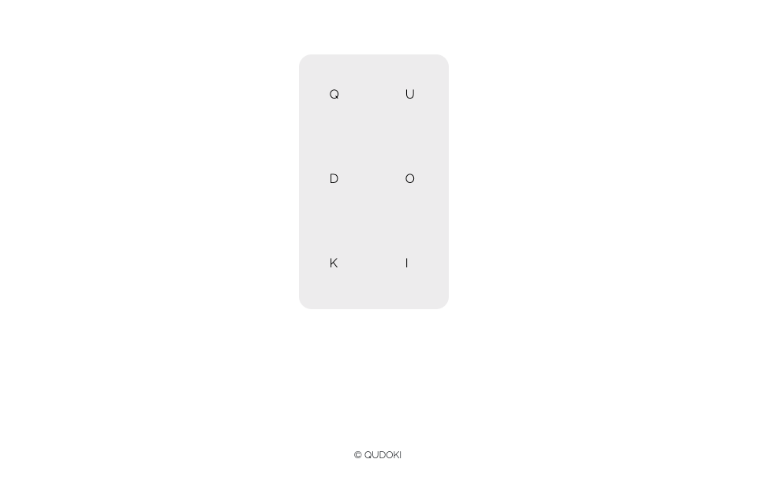
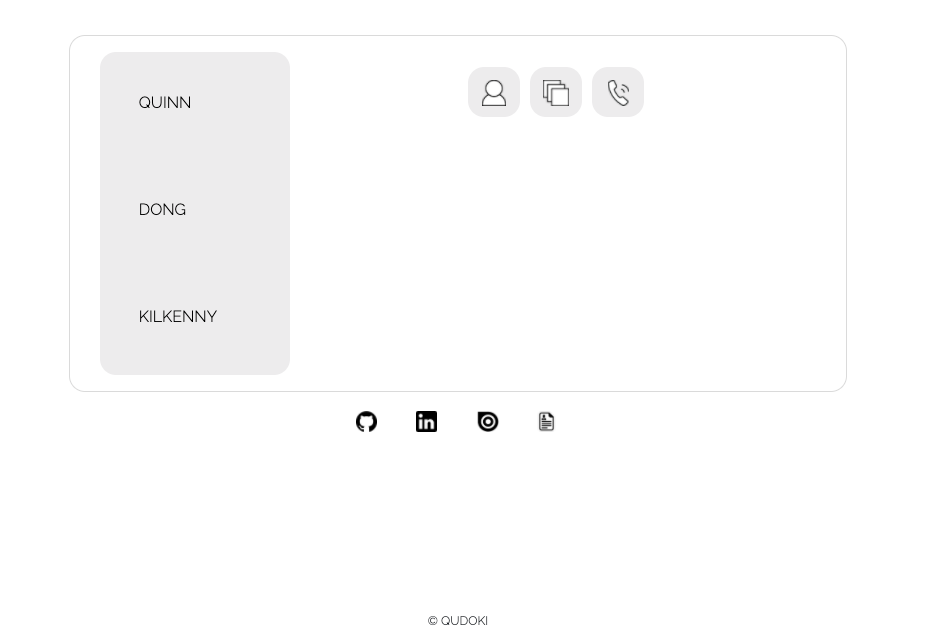
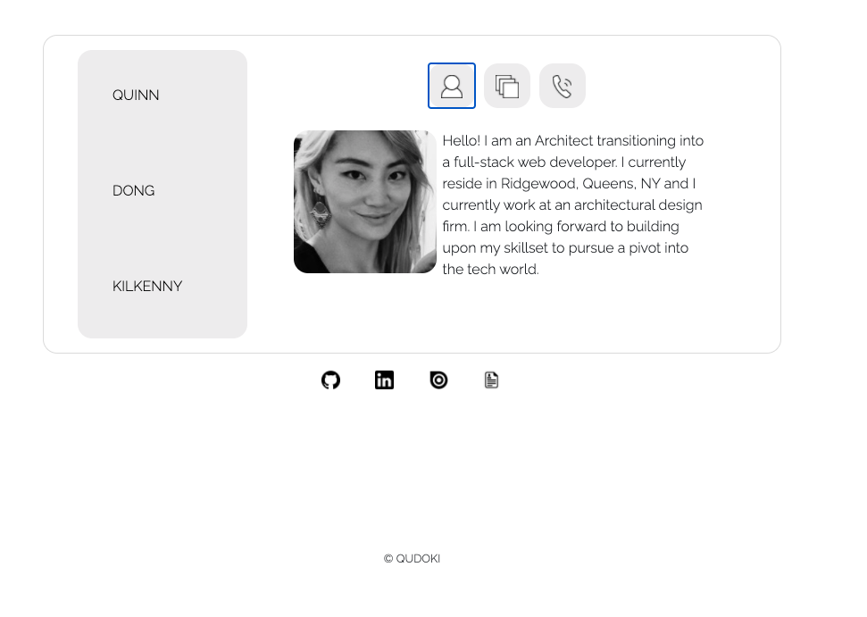
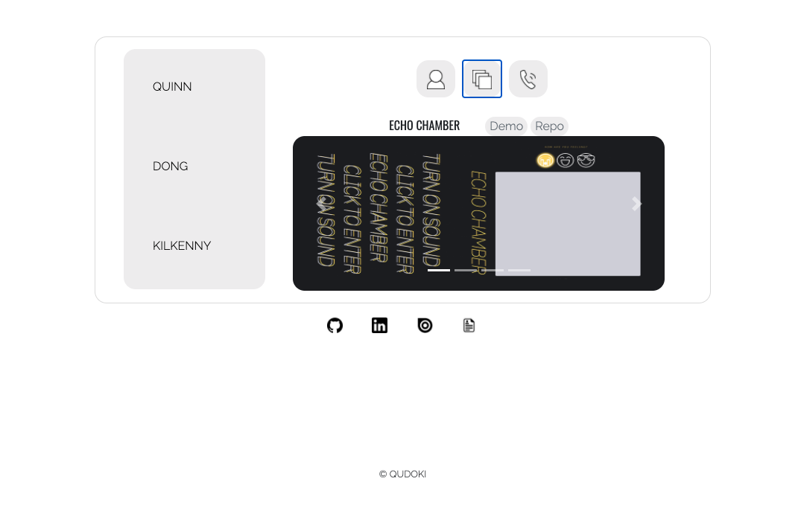
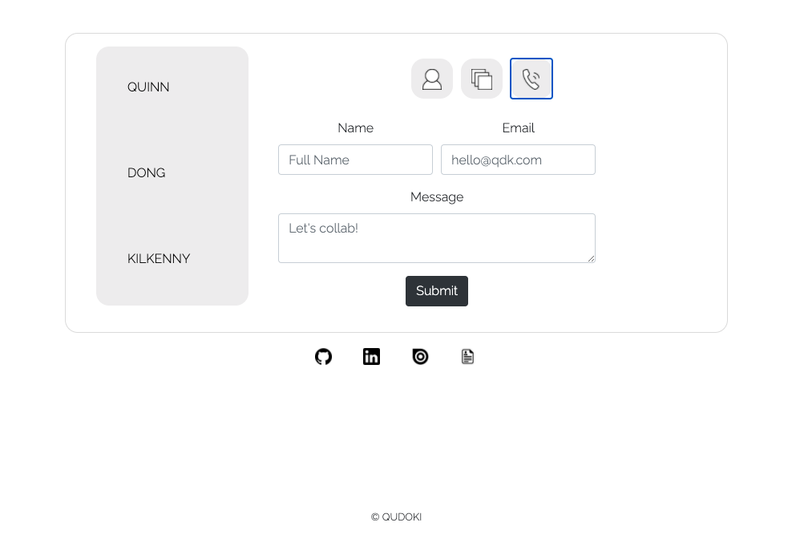
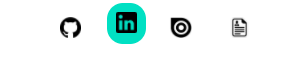

# Full Stack Portfolio Website

## Description:
A full stack portfolio website for career development, showcasing projects, an about page, as well as a contact form. Restructured to showcase simple design.

## Technologies Used:
* Structure:
  - HTML
* Design/Frameworks:
  - CSS
  - Bootstrap
* Functionality:
  - Javascript
  - jQuery

### Deployed Github Page
* [Github Page](https://qudoki.github.io/responsive-portfolio/)

### LinkedIn
* While I am currently unable to update my profile as I still work in the AEC industry, below displays a marked up profile that I would implement in anticipation of the full transition.
* 

### Screenshots
* 
* 
* 
* 
* 
* 

### License
* [Link to License](./LICENSE.md)
